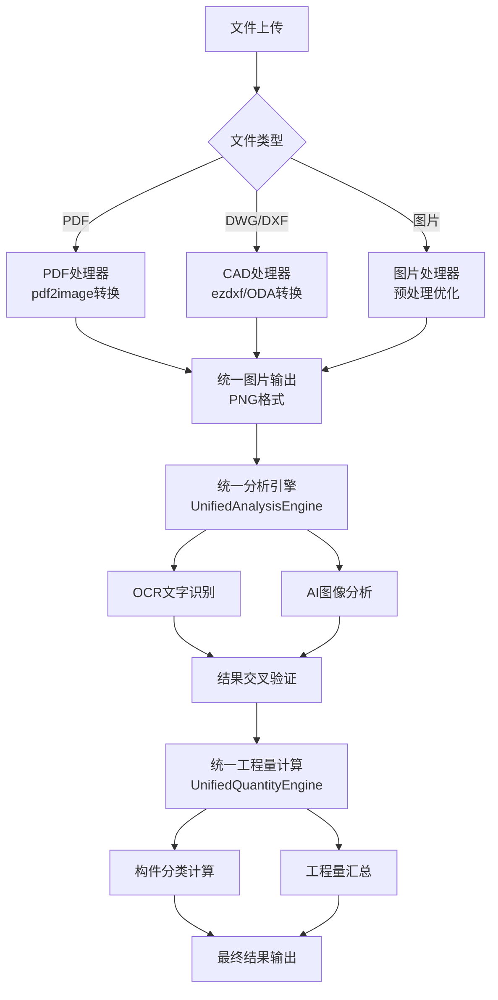

# 统一处理流程架构报告

## 概述

本次重构实现了三种文件类型（DWG/PDF/图片）的统一处理流程，消除了重复代码，建立了清晰的分工和数据流向。

## 系统架构图

```
文件上传 (DWG/PDF/图片)
    ↓
文件类型识别与分流
    ↓ ↓ ↓
[PDF处理器] [DWG处理器] [图片处理器]
    ↓ ↓ ↓
统一图片输出 (PNG格式)
    ↓
统一分析引擎 (UnifiedAnalysisEngine)
    ↓
[OCR识别] + [AI多模态分析] + [交叉验证]
    ↓
统一工程量计算引擎 (UnifiedQuantityEngine)
    ↓
[构件分类] + [工程量计算] + [清单生成]
    ↓
最终结果输出
```

## 核心模块

### 1. 文件预处理层
- **FileProcessor**: 统一文件预处理入口
  - PDF → `pdf2image` 转换
  - DWG/DXF → `ezdxf`/ODA 转换
  - 图片 → 直接使用或优化
  - **输出**: 统一的PNG图片格式

### 2. 统一分析引擎
- **UnifiedAnalysisEngine**: 二阶段智能分析
  - 阶段1: OCR文字识别 (`AdvancedOCREngine`)
  - 阶段2: AI图像分析 (`ChatGPTQuantityAnalyzer`)
  - 阶段3: 结果交叉验证
  - **输出**: 验证后的构件数据

### 3. 统一工程量计算引擎
- **UnifiedQuantityEngine**: 工程量计算与汇总
  - 构件类型分类
  - 工程量计算（混凝土/钢筋/模板）
  - 清单生成与汇总
  - **输出**: 完整的工程量清单

### 4. 任务编排层
- **drawing_tasks.py**: Celery异步任务编排
  - 统一任务流程管理
  - 实时状态推送
  - 错误处理与回滚

## 数据流程

### 三种文件类型的统一流程



## 优化成果

### 1. 消除重复代码
- **Before**: 分散的分析和计算模块
  - `dwg_processor.py` (119行)
  - `chatgpt_quantity_analyzer.py` (341行)
  - `quantity_calculator.py` (374行)
  - `advanced_ocr_engine.py` (604行)

- **After**: 统一的引擎架构
  - `UnifiedAnalysisEngine` - 统一分析入口
  - `UnifiedQuantityEngine` - 统一计算入口
  - 所有文件类型共用同一套分析和计算逻辑

### 2. 清晰的职责分工
- **文件处理**: 只负责格式转换
- **分析引擎**: 只负责构件识别
- **计算引擎**: 只负责工程量计算
- **任务编排**: 只负责流程控制

### 3. 统一的数据格式
- 所有文件类型转换后都是PNG图片
- 分析结果统一为构件数据结构
- 计算结果统一为工程量清单格式

### 4. 流程简化
```python
# 统一的处理流程（所有文件类型）
file_processing_result = file_processor.process_file(file_path, file_type)
analysis_result = analysis_engine.analyze_images(image_paths, source_type)
quantity_result = quantity_engine.calculate_quantities(analysis_result)
```

## 技术特点

### 1. 模块化设计
- 每个引擎职责单一，易于测试和维护
- 模块间通过标准接口通信
- 支持独立升级和扩展

### 2. 统一接口
- 所有文件类型使用相同的API
- 统一的错误处理机制
- 一致的日志格式

### 3. 高可维护性
- 新增文件类型只需扩展FileProcessor
- 优化分析算法只需修改UnifiedAnalysisEngine
- 调整计算规则只需修改UnifiedQuantityEngine

### 4. 性能优化
- 异步任务处理
- 临时文件自动清理
- 内存使用优化

## 配置文件

### 支持的文件类型
```python
supported_formats = {
    'pdf': ['.pdf'],
    'cad': ['.dwg', '.dxf'],
    'image': ['.jpg', '.jpeg', '.png', '.bmp', '.tiff']
}
```

### 构件类型映射
```python
component_types = {
    '柱': ['column', 'kz', '柱子', '框架柱', '构造柱'],
    '梁': ['beam', 'l', '梁', '框架梁', '连梁', '次梁', '主梁'],
    '板': ['slab', 'b', '板', '楼板', '屋面板', '底板'],
    '墙': ['wall', 'qz', 'q', '墙', '剪力墙', '挡土墙', '围护墙'],
    '基础': ['foundation', 'j', '基础', '独基', '条基', '筏板基础'],
    '楼梯': ['stair', 'lt', '楼梯', '楼梯间'],
    '其他': ['other', 'qt', '其它']
}
```

## 监控与日志

### 任务状态跟踪
- 实时任务进度推送
- 详细的错误日志
- 性能指标统计

### 日志级别
- INFO: 正常流程日志
- WARNING: 非致命性问题
- ERROR: 错误和异常

## 扩展性

### 新增文件类型
1. 在`FileProcessor`中添加处理逻辑
2. 转换为PNG格式输出
3. 自动流入统一分析流程

### 优化分析算法
1. 更新`UnifiedAnalysisEngine`
2. 保持接口不变
3. 所有文件类型自动受益

### 扩展工程量计算
1. 在`UnifiedQuantityEngine`中添加新的构件类型
2. 实现相应的计算公式
3. 自动集成到汇总流程

## 总结

通过这次架构重构，我们实现了：

1. **统一性**: 三种文件类型使用同一套处理流程
2. **简洁性**: 消除了重复代码，流程清晰
3. **可维护性**: 模块化设计，易于维护和扩展
4. **高效性**: 统一的资源管理和性能优化
5. **可扩展性**: 支持新文件类型和算法升级

这个架构为智能工程量计算系统提供了坚实的技术基础，支持未来的功能扩展和性能优化。 