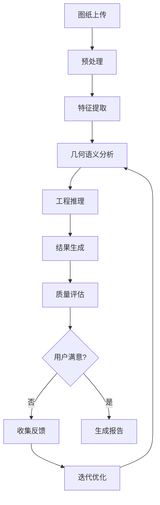

# 增强版图纸分析功能使用指南

## 功能概述

增强版图纸分析是智能工程量清单系统的核心功能升级，通过以下技术实现更精确的构件识别：

### 🚀 核心特性

#### 1. 几何语义理解
- **空间关系分析**：理解构件之间的位置关系（连接、相邻、包含等）
- **工程语义理解**：基于建筑工程知识进行推理
- **上下文感知**：结合图纸类型、项目阶段等信息优化识别

#### 2. 多轮交互优化
- **迭代改进**：基于用户反馈持续优化识别结果
- **重点关注**：针对特定构件类型或区域进行深度分析
- **人机协作**：结合AI智能分析和人工专业判断

#### 3. 增强版remark机制
- **决策透明化**：详细说明AI的识别依据和推理过程
- **置信度评估**：为每个识别结果提供可信度指标
- **改进建议**：自动生成质量提升建议

## 使用方法

### 步骤1：上传图纸并配置参数

```typescript
// 支持的文件格式
const supportedFormats = ['.pdf', '.png', '.jpg', '.jpeg'];

// 配置分析参数
const analysisConfig = {
  projectType: "住宅建筑",      // 项目类型
  drawingType: "基础平面图",     // 图纸类型  
  designStage: "施工图",        // 设计阶段
  confidenceThreshold: 0.7,     // 置信度阈值
  userFeedback: "重点关注柱子编号" // 预分析要求
};
```

### 步骤2：执行几何语义分析

系统将自动进行：
- 图像预处理和特征提取
- 几何形状识别和空间关系分析
- 工程语义理解和推理
- 构件属性提取和验证

### 步骤3：查看分析结果

分析结果包含以下信息：

```json
{
  "drawing_name": "基础平面布置图",
  "quantity_list": [
    {
      "sequence": 1,
      "component_type": "独立基础",
      "component_code": "DJC-1",
      "section_size": "2000×2000×500",
      "quantity": 12,
      "confidence_score": 0.92,
      "enhanced_remark": "基于基础平面图中的方形基础识别，尺寸标注清晰，位置分布规律，置信度较高"
    }
  ],
  "quality_assessment": {
    "overall_confidence": 0.85,
    "completeness_score": 0.78,
    "accuracy_indicators": ["尺寸标注完整", "构件编号清晰"],
    "improvement_suggestions": ["建议人工核实基础配筋信息"]
  }
}
```

### 步骤4：迭代优化（可选）

如果识别结果需要改进：

1. 点击"迭代优化"按钮
2. 提供具体的改进要求：
   ```
   改进要求: "柱子KZ-3的配筋信息不准确，应该是8φ25+φ10@200"
   重点关注: "柱子配筋、基础标高"
   ```
3. 系统将基于反馈重新分析并更新结果

## 质量评估指标

### 置信度分级
- **高置信度 (≥80%)**：绿色标识，可直接使用
- **中等置信度 (60-79%)**：黄色标识，建议人工核实
- **低置信度 (<60%)**：红色标识，需要重新分析

### 完整性评估
- **构件覆盖率**：识别出的构件数量占实际构件的比例
- **属性完整性**：每个构件的关键属性（编号、尺寸、数量等）完整程度
- **标注准确性**：识别结果与图纸标注的一致性

## API 接口说明

### 1. 几何语义分析接口

```http
POST /api/v1/enhanced-analysis/analyze-with-semantics
Content-Type: multipart/form-data

参数:
- file: 图纸文件
- project_type: 项目类型
- drawing_type: 图纸类型
- design_stage: 设计阶段
- confidence_threshold: 置信度阈值
- user_feedback: 用户反馈
```

### 2. 迭代优化接口

```http
POST /api/v1/enhanced-analysis/iterative-refinement/{drawing_id}
Content-Type: multipart/form-data

参数:
- user_feedback: 改进要求
- focus_areas: 重点关注区域
```

### 3. 质量报告接口

```http
GET /api/v1/enhanced-analysis/analysis-quality/{drawing_id}

返回:
- 详细的质量评估报告
- 统计信息和改进建议
- 每个构件的置信度分析
```

## 最佳实践

### 1. 参数配置建议
- **项目类型**：选择正确的建筑类型有助于提高识别精度
- **图纸类型**：准确的图纸类型分类是关键
- **置信度阈值**：建议从0.7开始，根据需要调整

### 2. 反馈优化技巧
- **具体明确**：提供具体的错误信息和正确答案
- **关注重点**：明确指出需要重点关注的构件或区域
- **逐步改进**：避免一次性提出过多修改要求

### 3. 质量控制
- **分阶段验证**：先验证构件类型，再检查具体属性
- **交叉对比**：结合多个视图和图纸进行验证
- **专业审核**：重要项目建议专业人员最终审核

## 技术架构



## 常见问题

### Q1: 为什么某些构件的置信度较低？
**A1**: 可能原因包括：
- 图纸清晰度不够
- 构件标注不完整
- 特殊构件类型训练数据不足

### Q2: 如何提高识别精度？
**A2**: 建议方法：
- 上传高清图纸
- 正确配置项目和图纸类型
- 使用迭代优化功能
- 提供具体明确的反馈

### Q3: 分析速度如何优化？
**A3**: 优化方向：
- 合理设置置信度阈值
- 明确指定关注区域
- 使用批量处理功能

## 更新日志

### v1.0.0 (2024-01-15)
- ✅ 实现几何语义理解算法
- ✅ 添加多轮交互优化功能
- ✅ 完善置信度评估机制
- ✅ 集成质量报告生成

### 即将发布
- 🔄 支持更多图纸格式
- 🔄 增加批量分析功能
- 🔄 优化处理速度
- 🔄 集成3D模型预览 